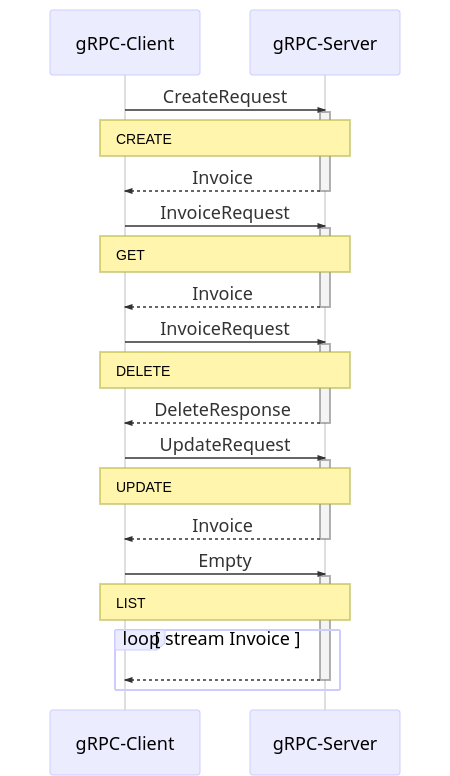

# Invoice generation system
[HOME](../../README.md)

We will implement an invoice generation system which will provide following operations:

- Create : To create a new invoice
- Get : Get an invoice by Id
- Delete : Delete an invoice by Id
- Update : Update amount and state of an invoice.
- List : Get list of all the invoices.

The idea is to implement invoice generation system as gRPC Server, gRPC Clients will connect to this server to perform crud operations on the invoice.

For simplicity, we will create a single client that perform Create, Get, Update, Delete and List operations in sequence over the same channel.

Below sequence diagram shows the allowed operations available via API and communication between client and server

