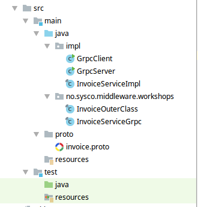

# Project setup
[HOME](../../README.md)

gRPC project should be able to achieve following objectives:
- Read .proto files as payload and service definition.
- Convert .proto files to target language. Java in our case.
- Correct package and directory location for generated code.
- Add generated code to source sets. This will ensure that compile and build phases find generated classes.
- If we intend to distribute the application. These compiled classes should be added to the distribution.

One way to achieve this by using **protoc** compiler which is available as binary. For this project we will configure gradle to do these tasks for us. Gradle will help us to achieve following objectives:
- Manage java and grpc dependencies.
- Configure protoc compiler.
- Configure code generation.
- Configure compile and runtime phases.
- Act as reusable template for other gRPC projects.

## Project structure
We start with creating a simple project structure. 
- All our java code will be available under `src/main/java`.
- We will define our protobuf description under `src/main/proto`.
- All generated code will be placed under `src/main/java/no/sysco/middleware/workshops`. We will configure gradle to do this automatically for us in build.gradle configurations
- All custom implementation for client-server wil be under `src/main/java/impl`
- All test cases will be under `src/test/java`



## Gradle settings
All our configuration are done in [build.gradle](../../build.gradle) shipped with this code repo.

### Configure project coordinates and variables
We start with defining a variable grpcVersion, we will reuse this later while defining project dependencies. Then we define the project coordinates. These will be useful when we want to distribute the executable via artifactory for example
```groovy
// variables
ext { grpcVersion = '1.7.0' }

// project coordinates
group = "no.sysco.middleware.workshops"
version = "1.0-SNAPSHOT"
```

### Configure and apply project level plugins
We need to use two plugins: `protobuf` and `java`. We start with defining the location for protobuf plugin and then asking gradle to apply these plugins.

```groovy
// Add plugin dependency before applying the plugin
buildscript {
  repositories { mavenCentral() }
  dependencies { classpath 'com.google.protobuf:protobuf-gradle-plugin:0.8.6' }
}
apply plugin: 'java'
apply plugin: 'com.google.protobuf'
```

### Setting for java plugin
By default the sourceSets for compilation is set to 'src/main/java' and 'src/main/proto'. If we want to setup additional location for source sets under this section 
```groovy
// java plugin compile, runtime configs
sourceCompatibility = 1.8
targetCompatibility = 1.8
sourceSets {
  // you can define alternate location for java and the proto source code here
  main {
    java {}  // default 'src/main/java'
    proto {} // default 'src/main/proto'
  }
}
```

### Defining project dependencies

```groovy
// Project dependencies
repositories { jcenter() }
dependencies {
  // Junit for testing
  testCompile 'junit:junit:4.12'
  
  // Grpc dependencies
  compile "com.google.api.grpc:proto-google-common-protos:1.0.0"
  compile "io.grpc:grpc-protobuf:${grpcVersion}"
  compile "io.grpc:grpc-stub:${grpcVersion}"
  compile "io.grpc:grpc-netty:${grpcVersion}"
  
  // logging dependencies
  compile "ch.qos.logback:logback-classic:1.2.3"
}
```

### Configuration for protobuf tasks 
The main configurations to note here are generatedFilesBaseDir and generateProtoTasks. We are instructing gradle to place the generated code under src/main/java directory. The generated code will automatically follow the package structure under src/main/java

```groovy
// Configure protobuf tasks
protobuf {
  // Use the below binary to compile protobuf to java
  protoc {
    artifact = 'com.google.protobuf:protoc:3.4.0'
  }
  plugins {
    // binary location for the grpc plugin
    grpc {
      artifact = "io.grpc:protoc-gen-grpc-java:${grpcVersion}"
    }
  }
  // directory where the generated file will be created
  generatedFilesBaseDir = "${projectDir}/src/"
  generateProtoTasks {
    all().each { t ->
      t.plugins {
        // subdirectory under generatedFilesBaseDir path where files should be generated
        grpc { outputSubDir = 'java' }
      }
    }
  }
}
```